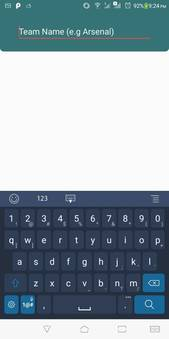

## Kelompok 8 - BolaSepak
* Arifin Rais - 13517067
* M. Khairul Makirin - 13517088
* Lucky Jonathan Chandra - 13517136

### Deskripsi Aplikasi
---
Aplikasi BolaSepak merupakan aplikasi untuk melihat jadwal pertandingan sepakbola Liga Inggris yang akan dilangsungkan maupun yang telah berlangsung, selain melihat jadwal pertandingan, pengguna juga dapat melihat detail pertandingan seperti cuaca, lokasi, dan highlights untuk pertandingan yang telah berlangsung, mencari team dan melihat detail team Liga Inggris, dan subscribe dengan suatu tim agar bisa mendapatkan notifikasi setiap tim tersebut akan melaksanakan pertandingan baru. Agar pengguna juga semakin giat berolahraga, aplikasi memiliki sebuah step counter yang menampilkan berapa banyak langkah yang telah diambil pengguna. Jika aplikasi tidak terhubung dengan internet maka aplikasi akan mengambil data dari cache yang disimpan.
### Cara Kerja
---
##### 1. Melihat pertandingan
Untuk melihat pertandingan, pengguna dapat melihatnya dari halaman pertama (home page) atau dari halaman detail tim, pada halaman pertama, penggunaa dapat memilih untuk melihat pertandingan dari tim langganannya atau dari semua tim di Liga Inggris, pada halaman detail tim, pengguna dapat melihat pertandingan lampau dan pertandingan yang akan mendatang dari tim tersebut.
##### 2. Melihat detail pertandingan lampau
Pengguna dapat melihat detail pertandingan yang dengan menekan tombol 'DETAILS' yang ada pada tiap view pertandingan, jika detail yang ingin dilihat adalah pertandingan yang sudah lampau aplikasi akan menampilkan highlights dari pertandingan tersebut yaitu berapa banyak goal dari tim home dan tim away beserta nama pemain yang menyetak goal tersebut.
##### 3. Melihat detail pertandingan mendatang
Pengguna dapat melihat detail pertandingan yang dengan menekan tombol 'DETAILS' yang ada pada tiap view pertandingan, jika detail yang ingin dilihat adalah pertandingan yang mendatang, maka aplikasi akan menampilkan lokasi pertandingan tersebut akan diselenggarakan dan cuaca di sekitar lokasi tersebut.
##### 4. Melihat detail tim
Untuk melihat detail tim, pengguna dapat mencari nama tim yang ingin dilihat dengan menekan tombol search di kanan bawah layar pada halaman pertama atau menekan logo/badge tim di tiap view pertandingan. Pada halaman detail tim aplikasi akan menampilkan badge tim, nama tim, dan pertandingan-pertandingan yang telah atau akan dihadiri oleh tim tersebut.
##### 5. Langganan dengan tim tertentu
Untuk pengguna dapat berlangganan dengan suatu tim, pengguna harus mengubah tombol slider yang terdapat pada kanan atas layar di halaman detail tim, jika pengguna telah berlangganan dengan suatu tim, maka pengguna akan mendapatkan notifikasi saat tim tersebut akan bertanding.
##### 6. Mencari tim
Pengguna dapat mencari tim yang bermain pada Liga Inggris dari halaman search yang dapat diakses oleh pengguna dengan menekan tombol search icon terletak pada kanan bawah layar di halaman pertama (home page), kemudian pengguna tinggal memasukkan nama tim yang ingin dicari.
##### 7. Step counter
Aplikasi akan mencatat dan menampilkan banyak langkah yang telah diambil pengguna sejak pengguna membuka aplikasi, perhitungan masih akan dilajutkan jika aplikasi di-minimize/pause.
### Library
---
1. Volley, digunakan untuk membuat HTTP Request ke API TheSportsDB dan OpenWeather
2. Gson, digunakan untuk memparsing hasil JSON dari HTTP Request Volley, ke dalam bentuk objek java
3. Glide, digunakan untuk memuat gambar ke komponen view (ImageView) dari URL
### Screeenshot Aplikasi
---

